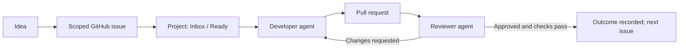

# GitHub Project Steward

[简体中文](README.zh-CN.md)

An installable Codex plugin that turns a GitHub repository into a managed product-and-development workflow: reusable Projects, structured idea capture, Markdown dashboards, and sequential developer-reviewer issue delivery.

> Independent open-source project. Not affiliated with or endorsed by GitHub or OpenAI.

## What it does

| Capability | Result |
| --- | --- |
| Create a Project | Copies the [public mother Project](https://github.com/users/coconilu/projects/4), links the target repository, preserves four views, and customizes Area options |
| List and show Projects | Renders all Projects or one Project as readable Markdown tables |
| Capture ideas | Turns rough ideas into scoped issues with acceptance criteria and Project fields |
| Plan issue batches | Orders issues by dependencies, Priority, Focus, value, risk, and Size |
| Deliver issues | Assigns one developer agent and one independent reviewer agent; fixes repeat until the review gate passes |



## Install in Codex

Prerequisites: Python 3.11+, [GitHub CLI](https://cli.github.com/), and an authenticated account with repository access and the `project` scope.

```powershell
gh auth status
gh auth refresh -s project -s repo
codex plugin marketplace add coconilu/github-project-steward
codex plugin add github-project-steward@github-project-steward
```

Start a new Codex task after installation so the bundled skills are discovered.

For an agent-executable installation request, see [docs/INSTALL_PROMPTS.md](docs/INSTALL_PROMPTS.md).

## Starter requests

```text
Create a GitHub Project for this repository. Infer Area options from the real architecture.
```

```text
List all my GitHub Projects and show every Project as its own table.
```

```text
Turn this idea into an issue, add it to Project 3, and set it to P1 / Now.
```

```text
Plan the open issues, then run the developer-reviewer delivery loop in that order.
```

## Bundled skills

| Skill | Use it for |
| --- | --- |
| `$github-project-board` | Create, link, list, and render GitHub Projects |
| `$github-idea-to-issue` | Convert ideas into managed issues |
| `$github-issue-delivery` | Plan and deliver an issue queue with two independent agents |

## The Project template

The template mirrors the workflow used by CaptionNest, AI UI Style Director, and NarraCut.

| Surface | Contract |
| --- | --- |
| Status | Inbox → Ready → In progress → In review → Done; plus Not planned |
| Planning | Priority P0–P3, Focus Now/Next/Later, Size S/M/L, repository-specific Area |
| Evidence | Linked pull requests, reviewers, milestones, Outcome, start and target dates |
| Views | Board, backlog, Completed, Roadmap |

GitHub currently exposes view reads but no public create/update mutations for Project views. The plugin therefore uses `gh project copy` against the public mother Project instead of approximating it field by field. See [docs/ARCHITECTURE.md](docs/ARCHITECTURE.md).

## Direct CLI

The skills call a dependency-free Python CLI. It is also useful for diagnosis:

```powershell
$cli = "plugins/github-project-steward/scripts/project_steward.py"
python $cli preflight
python $cli dashboard --owner coconilu
python $cli create-project --repo owner/repo --areas "Core,Web,API,Docs,Cross-cutting" --dry-run
python $cli issue-inventory --repo owner/repo --json
```

Write commands are idempotency-aware. A duplicate Project title fails unless `--reuse-existing` is supplied deliberately. Partial failures preserve the created GitHub resource and report its URL instead of deleting evidence automatically.

Transient read failures such as proxy `EOF` or GitHub CLI `unknown owner type` responses receive bounded retries. If all configured proxies are loopback, one final direct read is attempted; set `GH_STEWARD_DISABLE_DIRECT_FALLBACK=1` to disable it. Non-loopback proxies are never bypassed, and write commands are never replayed automatically after an ambiguous response.

## Development

No runtime Python packages are required.

```powershell
python scripts/validate_repo.py
python -m unittest discover -s tests -v
python C:\Users\admin\.codex\skills\.system\plugin-creator\scripts\validate_plugin.py plugins\github-project-steward
```

The first two commands are portable and run in CI. The last command uses the local Codex plugin validator when it is available.

## License

[MIT](LICENSE)
