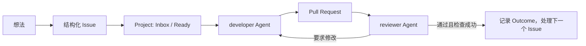

# GitHub Project Steward（GitHub 项目管家）

[English](README.md)

一个可安装、可分享的 Codex 插件：为 GitHub 仓库创建统一的 Projects 看板，把想法整理成 Issue，用 Markdown 表格展示所有看板，并按顺序调度 developer / reviewer 两个独立 Agent 完成交付。

> 独立开源项目，与 GitHub、OpenAI 无隶属或官方背书关系。

## 能做什么

| 能力 | 结果 |
| --- | --- |
| 创建 Project | 复制[公开母版 Project](https://github.com/users/coconilu/projects/4)，关联目标仓库，保留四个视图，并按仓库定制 Area |
| 罗列和展示 Projects | 罗列全部 Projects；每个 Project 独立输出一张 Markdown 表格，并默认隐藏 `Status = Done` 的条目 |
| 想法进入 Issue | 将模糊想法整理为带验收标准、非目标和 Project 字段的 Issue |
| 批量规划 Issue | 根据依赖、Priority、Focus、价值、风险和 Size 给出处理顺序 |
| 双 Agent 交付 | developer 开发并提交 PR，reviewer 独立审查；有问题就退回修复，直到审查门禁通过 |



## 安装到 Codex

前置条件：Python 3.11+、[GitHub CLI](https://cli.github.com/)，以及已登录且拥有仓库访问权和 `project` scope 的 GitHub 账号。

```powershell
gh auth status
gh auth refresh -s project -s repo
codex plugin marketplace add coconilu/github-project-steward
codex plugin add github-project-steward@github-project-steward
```

### 给 Agent 阅读的安装指令

把下面整段提示词复制给 Codex 或其他能够操作终端的 Agent：

```text
请为我安装公开 Codex 插件 GitHub Project Steward：
https://github.com/coconilu/github-project-steward

请自主完成安装。只有确实需要交互式 GitHub 登录或用户明确授权时，才暂停并向我说明。

1. 检查 `codex --version`、`python --version`（要求 Python 3.11+）和 `gh --version`。
2. 执行 `gh auth status`，确认当前账号能够访问目标仓库，并拥有 `repo` 和 `project`
   scope。若 scope 缺失，执行 `gh auth refresh -s repo -s project`。如果认证过程需要
   浏览器或用户交互，请暂停并告诉我需要执行的准确操作。
3. 执行 `codex plugin marketplace list --json`。
   - 如果不存在 `github-project-steward`，执行
     `codex plugin marketplace add coconilu/github-project-steward`。
   - 如果已经配置，执行 `codex plugin marketplace upgrade github-project-steward`，
     不要先删除它。
4. 执行 `codex plugin add github-project-steward@github-project-steward`。
5. 执行 `codex plugin list --json`，确认 `github-project-steward` 已安装且已启用。
6. 不要手工编辑 `marketplace.json`、`config.toml` 或其他无关插件配置。验证命令成功前，
   不要声称安装完成；若失败，请返回失败命令和脱敏后的错误信息，不要暴露 token。
7. 安装成功后，提醒我新建一个 Codex 任务，以便加载插件内的技能。
```

安装后新建一个 Codex 任务，让 Codex 重新发现插件内的技能。更多安装方式见 [docs/INSTALL_PROMPTS.md](docs/INSTALL_PROMPTS.md)。

## 常用指令

```text
参考公开母版，为当前仓库创建 GitHub Project；请根据真实架构推断 Area。
```

```text
罗列我所有的 GitHub Projects，并把每个 Project 独立显示为一张表格。
```

展示看板时默认隐藏已完成条目。需要完整历史时，明确说“包含已完成”，或在 CLI 中传入 `--include-completed`。

```text
把这个想法整理成 Issue，加入 Project 3，并设置为 P1 / Now。
```

```text
规划所有开放 Issue 的处理顺序，然后按顺序运行 developer-reviewer 交付循环。
```

## 插件内的三个技能

| Skill | 作用 |
| --- | --- |
| `$github-project-board` | 创建、关联、罗列和展示 GitHub Projects |
| `$github-idea-to-issue` | 把想法变成受管理的 Issue |
| `$github-issue-delivery` | 用两个独立 Agent 规划并交付 Issue 队列 |

## 看板母版

母版复刻了 CaptionNest、AI UI Style Director 和 NarraCut 当前共用的工作方式。

| 层面 | 约定 |
| --- | --- |
| Status | Inbox → Ready → In progress → In review → Done；另有 Not planned |
| 规划字段 | Priority P0–P3、Focus Now/Next/Later、Size S/M/L、仓库专属 Area |
| 交付证据 | Linked pull requests、Reviewers、Milestone、Outcome、起止日期 |
| 视图 | Board、backlog、Completed、Roadmap |

GitHub 当前公开 API 能读取 Project 视图，却没有创建或修改视图的 mutation。因此插件使用 `gh project copy` 复制公开母版，而不是重新拼一份“不完全相同”的字段集合。详细设计见 [docs/ARCHITECTURE.md](docs/ARCHITECTURE.md)。

## 直接使用 CLI

技能底层调用一个零第三方依赖的 Python CLI，也可以直接用来诊断：

```powershell
$cli = "plugins/github-project-steward/scripts/project_steward.py"
python $cli preflight
python $cli dashboard --owner coconilu
python $cli dashboard --owner coconilu --include-completed
python $cli create-project --repo owner/repo --areas "Core,Web,API,Docs,Cross-cutting" --dry-run
python $cli issue-inventory --repo owner/repo --json
```

写操作带有幂等保护：标题相同的 Project 默认拒绝重复创建；只有明确传入 `--reuse-existing` 才会继续配置。发生部分失败时，CLI 会保留已经创建的 GitHub 资源并返回 URL，不会自动删除证据。

代理 `EOF`、GitHub CLI `unknown owner type` 等瞬时只读失败会进行有界重试。若配置的代理全部指向本机回环地址，还会尝试一次直连只读请求；设置 `GH_STEWARD_DISABLE_DIRECT_FALLBACK=1` 可禁止该回退。非本机代理绝不会被绕过，响应不明确时所有写操作也不会自动重放。

## 开发与验证

运行时不依赖任何 Python 第三方包。

```powershell
python scripts/validate_repo.py
python -m unittest discover -s tests -v
python C:\Users\admin\.codex\skills\.system\plugin-creator\scripts\validate_plugin.py plugins\github-project-steward
```

前两项会在 CI 中跨 Windows / Linux 执行；第三项在本机具备 Codex 插件验证器时执行。

## 许可证

[MIT](LICENSE)
