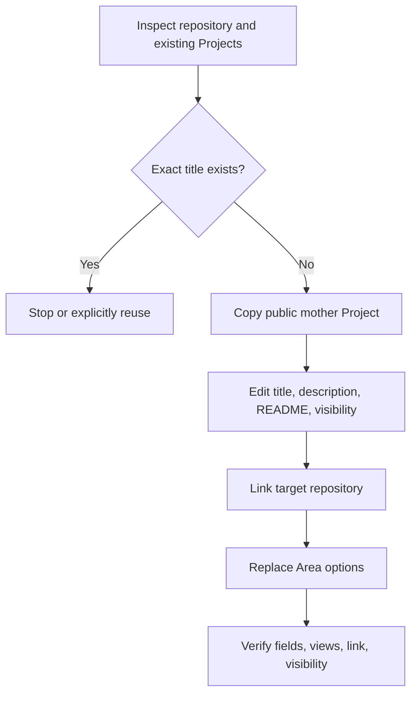
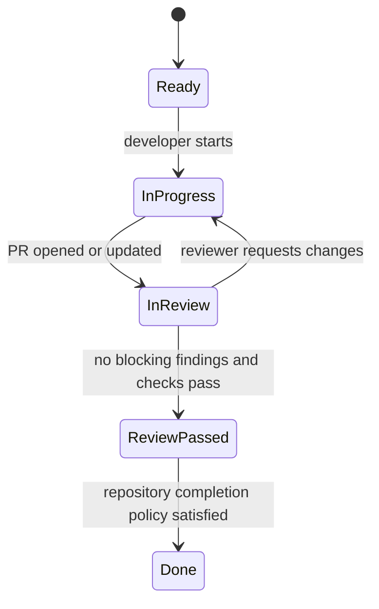

# Architecture

## System boundary

| Layer | Responsibility | Does not own |
| --- | --- | --- |
| Codex plugin manifest | Installable distribution and discovery | GitHub authentication |
| `github-project-board` skill | Project intent, safety checks, and presentation | Free-form GraphQL mutations |
| `github-idea-to-issue` skill | Issue shaping, duplicate judgment, and Project placement | Product decisions absent from evidence |
| `github-issue-delivery` skill | Queue planning and two-agent review gate | Automatic merge authorization |
| `project_steward.py` | Deterministic `gh` calls, field IDs, idempotency, Markdown | Prioritization judgment or code implementation |
| GitHub CLI | User authentication and GitHub API transport | Codex agent orchestration |

The plugin deliberately does not ship a second GitHub MCP server. It uses the user's authenticated `gh` session because GitHub Projects operations and `project` scope are already available there, while the skills remain portable and inspectable.

## Repository layout

```text
.agents/plugins/marketplace.json        Public marketplace catalog
plugins/github-project-steward/
  .codex-plugin/plugin.json             Plugin manifest
  skills/                               Three intent-specific skills
  scripts/project_steward.py            Dependency-free deterministic CLI
  templates/default-project.json        Reviewable mother-Project contract
scripts/validate_repo.py                Portable CI validation
tests/                                  Offline unit tests
```

## Why Project copy is the core primitive

The current GitHub GraphQL schema exposes `ProjectV2View` queries, but the mutation surface has no create or update operation for Project views. Creating custom fields alone therefore cannot recreate Board, backlog, Completed, and Roadmap.



This preserves view configuration from one public, auditable source. The JSON snapshot records the expected contract so drift can be reviewed in git.

## Issue delivery state machine



Only the developer writes. The reviewer reads the issue, PR diff, checks, and repository rules after the PR exists. A clean review makes the PR ready for human merge by default; it does not grant merge authority.

## Failure model

| Failure | Behavior |
| --- | --- |
| Missing `gh`, auth, scope, or repository access | Stop before writes |
| Loopback proxy makes `gh auth status` misreport an invalid token | Recheck authentication once through the direct read fallback |
| Transient `EOF`, timeout, or `unknown owner type` on a read | Retry with bounded backoff; when every configured proxy is loopback, try twice through it and then one direct read |
| Duplicate Project title | Fail unless explicit reuse is requested |
| Project created but later configuration fails | Preserve it, return the URL, repair in place |
| Issue created but Project placement fails | Preserve the issue, return the URL, repair fields |
| Reviewer requests changes | Return to the same developer, then re-review the new SHA |
| Three identical unresolved review cycles | Stop for a human architecture or product decision |

## Security model

- No token is stored or transmitted by this repository; `gh` owns authentication.
- Subprocess calls never use a shell.
- Only read-only GitHub operations are automatically retried; create and update operations are never replayed after an ambiguous response.
- A failed loopback proxy can receive one direct read fallback. Set `GH_STEWARD_DISABLE_DIRECT_FALLBACK=1` to forbid that fallback. Corporate or other non-loopback proxies are never bypassed.
- Private repositories default to private Projects.
- Offline tests never mutate GitHub.
- The plugin never auto-deletes partial resources and never auto-merges a PR.
